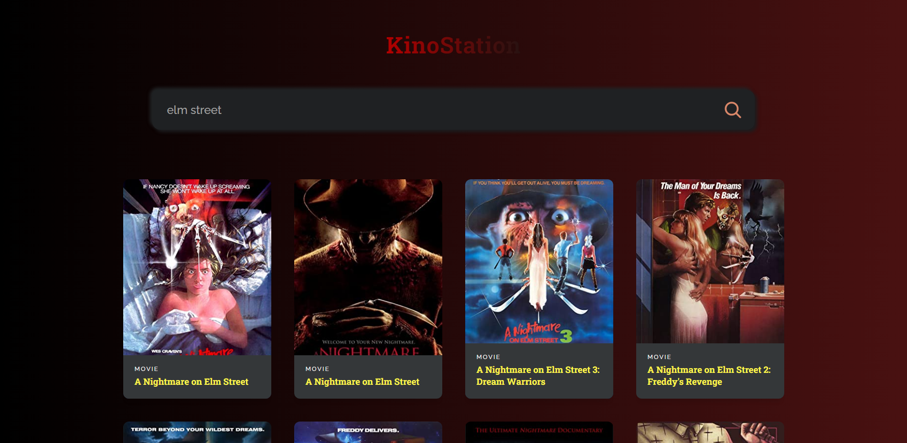
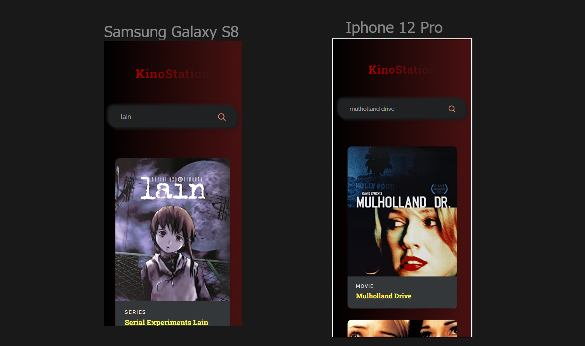

# **KinoStation 🍿🎬**
# 
**KinoStation** is a movie search application that allows users to search for movies by title. The app is built using React, a JavaScript library for building user interfaces, and it makes use of the **Open Movie Database** API to search for movies. The Open Movie Database API is a free, public API that provides movie information such as title, year, actors, and plot.

With its simple and intuitive design, KinoStation makes it easy for users to find the movies they are looking for. The app features a search bar where users can enter a movie title, and a search icon that when clicked on, calls the API and retrieves a list of movies that match the search term. The search results are displayed in a list and when a user clicks on a movie, detailed information about the movie such as plot, actors, and rating, is displayed.

The app also features a sleek and modern user interface, that makes it easy for users to navigate and find the information they need. The app was built using **React hooks**, which allows developers to use state and lifecycle methods in functional components. Additionally, the app is designed to be **fully responsive** on mobile devices, ensuring that users can easily search for movies and view detailed information on **smaller screens**.

# 

## **Features 🔎**
* Search for movies by title 🔍
* Display search results in a list 📜
* Display detailed information about each movie when clicked on 🎥
* Sleek and modern user interface 👌
# Getting started 🚀
 You can try the app by visiting the following [Project Link](). The app is hosted on Github and can be accessed and run by anyone with an internet connection.

# How to use 📚
1. Type a movie title in the search bar.
2. Click on the search icon or press enter.
3. The app will display a list of movies that match the search term.
4. Click on a movie to see more information about it.

## 🛠 Technologies

- React.js
- Javascript
- Git and Github

## Contact

lucasps465@outlook.com
# Note ⚠️
This application uses **Open Movie Database API**, you will need to provide **your own API key** in the .env file to make the search function work. The API has a **usage limit**, so it's important to use it wisely and respect their terms of service.